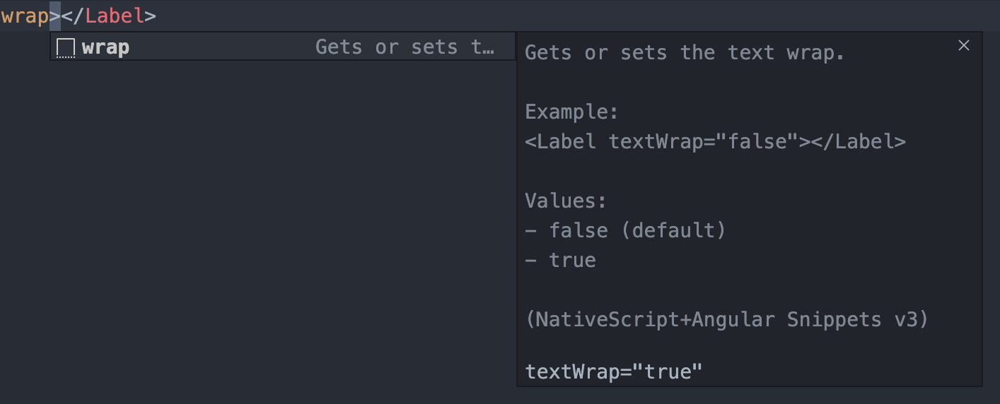

## NativeScript + Angular Snippets for Visual Studio Code ##

Now compatible with Angular 4.x and above.

This JSON file contains snippets for all NativeScript UI components and some frequently used attributes specifically for use with [nativescript-angular](https://github.com/NativeScript/nativescript-angular).

All UI components are prefixed with ```ns```. Attributes do not have a prefix.

<!--  -->


### UI Components

#### From within TypeScript `Component` Files:

- Component with inline template - ```nscomponent_template```
- Component with templateUrl - ```nscomponent_templateUrl```

The following can be used inside both TypeScript and HTML view files:

#### Layouts
- Absolute Layout - ```nsabsolute```
- Dock Layout - ```nsdock```
- Flexbox Layout - ```nsflexbox```
- Grid Layout - ```nsgrid```
- Stack Layout - ```nsstack```
- Wrap Layout - ```nswrap```

### Widgets
- Action Bar - ```nsactionbar```
- Action Bar with Back Button - ```nsactionbarback```
- Label - ```nslabel```
- Text Field - ```nstextfield```
- Secure Text Field (for passwords) - ```nspassword```
- Text View - ```nstextview```
- Image - ```nsimg```
- Border - ```nsborder```
- Button - ```nsbtn```
- Search Bar - ```nssearchbar```
- Switch - ```nsswitch```
- Slider - ```nsslider```
- Progress - ```nsprogress```
- Activity Indicator - ```nsloading```
- Date Picker - ```nsdate```
- Time Picker - ```nstime```
- List Picker - ```nslistpicker```
- Segmented Bar - ```nssegmentedbar```
- Tab View - ```nstabview```
- List View - ```nslistview```
- Web View - ```nswebview```

### Attributes
- cssClass - ```css```
- text - ```text```
- icon - ```icon```
- tap - ```tap```
- textWrap - ```wrap```
- horizontalAlignment - ```halign```
- verticalAlignment - ```valign```
- visibility - ```visibility```
- stretch - ```stretch```
- keyboardType - ```kbtype```
- colSpan - ```colspan```
- rowSpan - ```rowspan```
- row - ```row```
- col - ```col```
- width - ```width```
- height - ```height```
- ios.position - ```ios.position```
- ios.systemIcon - ```ios.systemIcon```
- android.position - ```android.position```
- android.systemIcon - ```android.systemIcon```
- iosIconRenderingMode - ```iosIconRenderingMode```
- iosOverflowSafeArea - ```iosOverflowSafeArea```
- iosOverflowSafeAreaEnabled - ```iosOverflowSafeAreaEnabled```

### Events

- loaded - ```nsloaded```
- unloaded - ```nsunloaded```
- layoutChanged - ```nslayoutChanged```
- busyChange - ```nsbusychanged```


## How to use?

1. Inside Visual Studio Code press
   ```bash
   CTRL + P
   ```
   
2. Type the following in the console window
    ``` bash
    ext install nativescript-ng2-snippets
    ```
3. Hit enter.


## Want to contribute?

  1. Fork this repo
  2. Open the project
  3. Modify snippets in `html.json` or `typescript.json`
  4. If using VSCode, hit `F5` to open VSCode debug window
  5. Then create an `index.html` or `test.ts` file (to test html or ts snippets respectively)
  6. If all is good then submit a PR!


# Release Notes
## 3.0 Feb 23, 2020

## New Features
* **Platform Specific ActionItem Support** 


* **Added Dropdown Suggestions**


* **Added Description, Example, and Supported Values to Snippets**



* **Added Debug Configuration** To enable the community to help us. To use just hit `F5` and a debug window of VSCode will appear.

* **Updated Readme**

* **New Snippets** We hope you'll enjoy some of the new snippets we've added!
  - `iosIconRenderingMode` 
  - `iosOverflowSafeArea`
  - `iosOverflowSafeAreaEnabled`
  - `ios.position`
  - `ios.systemIcon`
  - `android.position` 
  - `android.systemIcon`
  - `nsloaded`
  - `nsunloaded`
  - `nslayoutchanged`
  - `nsbusychanged`

* **Changed Snippets** Take a second to review the snippets that were changed in this release. Let us know if you have any issues or suggestions!
  - `nsactionbar`
  - `nsborder` 
  - `stretch`
  - `kbtype`
  - `wrap`  
  - `halign`
  - `valign`
  - `nsloading`


## Bug fixes
* Remove broken link from readme
